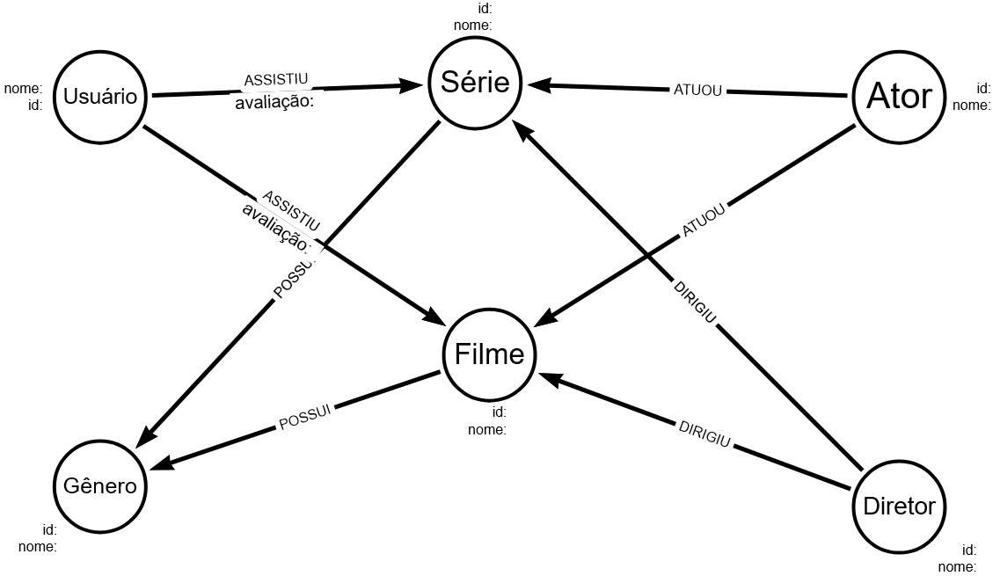
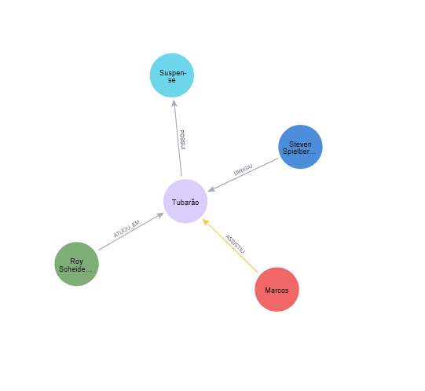

# Graph data model da plataforma de filmes e séries

Modelagem de uma plataforma para acompanhar e analisar filme e séries assistidos por usuários com o intuito de gerar insights sobre consumo, estilo de conteúdo apreciado, relevância de conteúdo entre outras possibilidades. Através da arquitetura de dados com grafos utilizando-se do Neo4J como principal tecnologia as questões levantadas serão elucidadas por meio de modelos graficos.

# Modelagem da plataforma de filmes e séries

### Nós

- Usuário: Usuário da plataforma.
- Série: Seriado.
- Filme: Filme telivisionado ou streaming. 
- Ator: Ator ou Atriz que atua num filme ou seriado.
- Diretor: Diretor que coordena um seriado ou filme.
- Gênero: Estilo do seriado ou filme.

### Relacionamentos


(:Usuario)-[:ASSISTIU {avaliação:int]->(:Filme | :Serie)
Exibe os conteudos que o usuário assistiu com nota atribuida.

(:Ator)-[:ATUOU]->(:Filme | :Serie)
Relaciona os atores/atrizes que contracenam nos filmes e seriados.

(:Diretor)-[:DIRIGIU]->(:Filme | :Serie)
Relaciona os diretores aos filmes e seriados que produziram.

(:Filme)-[:POSSUI]->(:Genero)

(:Serie)-[:POSSUI]->(:Genero)
Agrupa cada seriado ou filme a um tipo de conteudo.

## Modelagem do diagrama de dados

	

## Exemplos de Cypher querys

Filmes assistidos por um usuário

```cypher
MATCH (u:Usuario {name: "Marcos"})-[ua:ASSISTIU]->(f:Filme)
RETURN u, ua, f;
```

Visão detalhada do conteúdo assistisdo por um usuário

```cypher
MATCH (u:Usuario {name: "Marcos"})-[ua:ASSISTIU]->(f:Filme)
MATCH (d:Diretor)-[dd:DIRIGIU]->(f)
MATCH (f)-[fp:POSSUI]->(g:Genero)
MATCH (a)-[aa:ATUOU_EM]->(f)
RETURN u, ua, f, d, dd, fp, g, a, aa;
```

##### Observação: A cada MATCH o resultado é filtrado e exibido apenas os resultados que contemplem todos os filtros criados.


## Examplo grafo de conhecimento do Marcos

